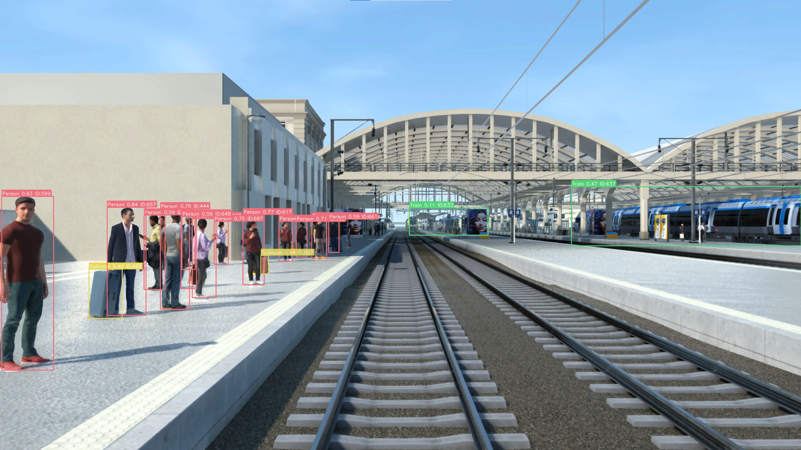

# Demo Train Simulator

This is a simple prototype that demonstrates Yolo tracking on Harfang 3D scene in different situations (fog, night, day).

## Project Overview

> This project aims to develop a prototype train driving simulator using the Harfang 3D engine. The simulator will serve as a training environment for an AI focused on the development of autonomous train systems. Through this simulator, the AI will gain experience in navigating rail environments under various conditions, from weather to lighting changes, to prepare it for real-world challenges.

## Technologies Used

- **Programming Language:** Python, Lua
- **3D Engine:** Harfang 3D
- **Simulation:** Custom-built train simulation environment leveraging Harfang 3D's features for realistic rendering with basic animation features.

### Process

1. Build assets using `build.bat`.
2. Then use `start.bat` to dump images into image_reims_{weather_mode} (fog, day, night).
3. Once your `image_reims_{weather_mode}` start `encode_video.bat`, replace images_reims_{night} folder's name by your actual weather mode.
4. This will create a video named `double_train_reims_{weather_mode}_QHD.mp4`.
5. Finaly, start `python simulated_image_analyser.py`.
6. This will create a video in `output_videos/` folder named `{weather_mode}_labeled_final.mp4`.

### Project Parameters

- In main.lua file you can change the following parameters
    ```lua 
        weather_mode = "night" /* "fog", "day" */
        capture_mode = true 
        /* If you change this to false, it will show the screen else, press F9 to start capturing*/
    ```

- In train_image_analyser.py
    ```python
        video_path = "double_train_reims_night_QHD.mp4" # Path to video created afted using main.lua
        output_path = "output_videos/night_labeled_final.mp4" # Path to the output video
    ```

- In encode_video.bat
    ```
        images_reims_night\capture_%%04d.png 
        you can change night by fog or day
    ```

### Screenshots



---

## Tracking Data Results

## Day Conditions

| Class | MeanConf | StdConf | MedianConf | MinConf | MaxConf | NumSamples |
|:------|:--------:|:-------:|:----------:|:-------:|:-------:|------------|
| Airplane | 0.4179 | 0.2192 | 0.5706 | 0.1079 | 0.5750 | 3 |
| Backpack | 0.2193 | 0.0705 | 0.2062 | 0.1050 | 0.3453 | 16 |
| Bench | 0.5157 | 0.2466 | 0.4797 | 0.1004 | 0.9000 | 1770 |
| Book | 0.2698 | 0.0865 | 0.3112 | 0.1751 | 0.4035 | 7 |
| Bus | 0.4666 | 0.2200 | 0.4131 | 0.1579 | 0.7860 | 190 |
| Car | 0.3813 | 0.1754 | 0.3564 | 0.1042 | 0.8205 | 938 |
| Cell phone | 0.3699 | 0.0561 | 0.3667 | 0.3136 | 0.4324 | 4 |
| Chair | 0.2282 | 0.0899 | 0.2306 | 0.1079 | 0.3878 | 29 |
| Clock | 0.3415 | 0.1896 | 0.3011 | 0.1002 | 0.7566 | 334 |
| Cup | 0.3681 | 0.0008 | 0.3681 | 0.3674 | 0.3689 | 2 |
| Fire hydrant | 0.3340 | 0.0000 | 0.3340 | 0.3340 | 0.3340 | 1 |
| Handbag | 0.4364 | 0.1460 | 0.4477 | 0.1001 | 0.7557 | 1258 |
| Person | 0.5552 | 0.2250 | 0.5751 | 0.1000 | 0.9466 | 22275 |
| Refrigerator | 0.4172 | 0.1458 | 0.4750 | 0.1173 | 0.6784 | 62 |
| Suitcase | 0.3547 | 0.1534 | 0.3449 | 0.1005 | 0.7723 | 157 |
| Surfboard | 0.1415 | 0.0000 | 0.1415 | 0.1415 | 0.1415 | 1 |
| Tie | 0.3028 | 0.0000 | 0.3028 | 0.3028 | 0.3028 | 1 |
| Traffic light | 0.2898 | 0.1164 | 0.2764 | 0.1001 | 0.7341 | 2766 |
| Train | 0.4946 | 0.2343 | 0.4493 | 0.1020 | 0.9756 | 5537 |
| Truck | 0.2181 | 0.0761 | 0.1895 | 0.1412 | 0.3492 | 9 |
| Tv | 0.4100 | 0.2230 | 0.3480 | 0.1004 | 0.8457 | 493 |
| Umbrella | 0.1288 | 0.0014 | 0.1288 | 0.1273 | 0.1302 | 2 |
| **OVERALL** | **0.5085** | **0.2309** | **0.4869** | **0.1000** | **0.9756** | **35855** |

## Night Conditions

| Class | MeanConf | StdConf | MedianConf | MinConf | MaxConf | NumSamples |
|:------|:--------:|:-------:|:----------:|:-------:|:-------:|------------|
| Backpack | 0.3138 | 0.0785 | 0.3142 | 0.2345 | 0.3923 | 4 |
| Bench | 0.5104 | 0.2088 | 0.5269 | 0.1063 | 0.8548 | 1227 |
| Bus | 0.2474 | 0.1313 | 0.1753 | 0.1013 | 0.4069 | 5 |
| Chair | 0.2581 | 0.1040 | 0.2597 | 0.1119 | 0.4681 | 43 |
| Clock | 0.3852 | 0.1783 | 0.3724 | 0.1004 | 0.8515 | 724 |
| Handbag | 0.4327 | 0.1750 | 0.4273 | 0.1004 | 0.7586 | 474 |
| Person | 0.4898 | 0.1945 | 0.4976 | 0.1001 | 0.8776 | 15442 |
| Potted plant | 0.1784 | 0.0417 | 0.1466 | 0.1414 | 0.2301 | 5 |
| Suitcase | 0.3886 | 0.0440 | 0.3954 | 0.3178 | 0.4764 | 19 |
| Traffic light | 0.2169 | 0.0829 | 0.1954 | 0.1067 | 0.4170 | 49 |
| Train | 0.3945 | 0.2460 | 0.3094 | 0.1000 | 0.9344 | 2880 |
| Truck | 0.1953 | 0.0786 | 0.1604 | 0.1070 | 0.3341 | 15 |
| Tv | 0.4466 | 0.1855 | 0.4765 | 0.1009 | 0.7241 | 281 |
| Umbrella | 0.3315 | 0.1110 | 0.3305 | 0.1257 | 0.5149 | 38 |
| **OVERALL** | **0.4708** | **0.2059** | **0.4728** | **0.1000** | **0.9344** | **21206** |

## Fog Conditions

| Class | MeanConf | StdConf | MedianConf | MinConf | MaxConf | NumSamples |
|:------|:--------:|:-------:|:----------:|:-------:|:-------:|------------|
| Airplane | 0.1494 | 0.0006 | 0.1494 | 0.1488 | 0.1500 | 2 |
| Backpack | 0.2823 | 0.1654 | 0.2142 | 0.1078 | 0.5177 | 10 |
| Bench | 0.5641 | 0.2183 | 0.5730 | 0.1010 | 0.9079 | 1772 |
| Book | 0.1989 | 0.0930 | 0.1479 | 0.1400 | 0.3598 | 4 |
| Bus | 0.4004 | 0.2252 | 0.4720 | 0.1007 | 0.7202 | 110 |
| Car | 0.4242 | 0.1814 | 0.4204 | 0.1004 | 0.8377 | 1035 |
| Clock | 0.3835 | 0.1726 | 0.3741 | 0.1020 | 0.7773 | 924 |
| Cup | 0.3881 | 0.0308 | 0.3769 | 0.3501 | 0.4355 | 7 |
| Fire hydrant | 0.2813 | 0.0833 | 0.3159 | 0.1311 | 0.3840 | 25 |
| Handbag | 0.4450 | 0.1402 | 0.4429 | 0.1018 | 0.7650 | 1439 |
| Person | 0.5821 | 0.2156 | 0.6245 | 0.1004 | 0.9442 | 19664 |
| Refrigerator | 0.3197 | 0.0865 | 0.3115 | 0.1092 | 0.4700 | 39 |
| Skateboard | 0.4631 | 0.0688 | 0.4161 | 0.4128 | 0.5605 | 3 |
| Suitcase | 0.3349 | 0.1213 | 0.3189 | 0.1182 | 0.5534 | 157 |
| Teddy bear | 0.2179 | 0.0578 | 0.2348 | 0.1333 | 0.2892 | 17 |
| Tie | 0.3725 | 0.0698 | 0.3347 | 0.3068 | 0.4941 | 11 |
| Traffic light | 0.2440 | 0.0965 | 0.2306 | 0.1012 | 0.6193 | 893 |
| Train | 0.5124 | 0.2361 | 0.4910 | 0.1008 | 0.9728 | 4958 |
| Tv | 0.4722 | 0.2191 | 0.4509 | 0.1027 | 0.8568 | 759 |
| Umbrella | 0.1640 | 0.0450 | 0.1670 | 0.1102 | 0.3110 | 23 |
| **OVERALL** | **0.5379** | **0.2247** | **0.5483** | **0.1004** | **0.9728** | **31852** |

## Summary

The data shows object detection performance across three environmental conditions:
- **Day**: Best overall performance with mean confidence of 0.5085
- **Night**: Reduced performance with mean confidence of 0.4708
- **Fog**: Moderate performance with mean confidence of 0.5379

Person detection consistently shows the highest number of samples and strong confidence across all conditions.

## Miscellaneous

[1] Udacity, Self-Driving Car Dataset, Roboflow Public Object Detection. [Online]. Available: https://public.roboflow.com/object-detection/self-driving-car

[2] M. Cordts, M. Omran, S. Ramos, T. Rehfeld, M. Enzweiler, R. Benenson, U. Franke, S. Roth, and B. Schiele, The Cityscapes Dataset for Semantic Urban Scene Understanding. [Online]. Available: https://www.cityscapes-dataset.com/

[3] A. Geiger, P. Lenz, and R. Urtasun, The KITTI Vision Benchmark Suite. [Online]. Available: https://www.cvlibs.net/datasets/kitti/

[4] Comma.ai, comma2k19 – A Driving Dataset for Autonomous Car Research. [Online]. Available: https://academictorrents.com/details/65a2fbc964078aff62076ff4e103f18b951c5ddb

[5] Y. Manabe, T. Yatagawa, S. Morishima, and H. Kubo, “Monte Carlo Path Tracing and Statistical Event Detection for Event Camera Simulation,” arXiv preprint arXiv:2408.07996, 2024. [Online]. Available: https://arxiv.org/abs/2408.07996

